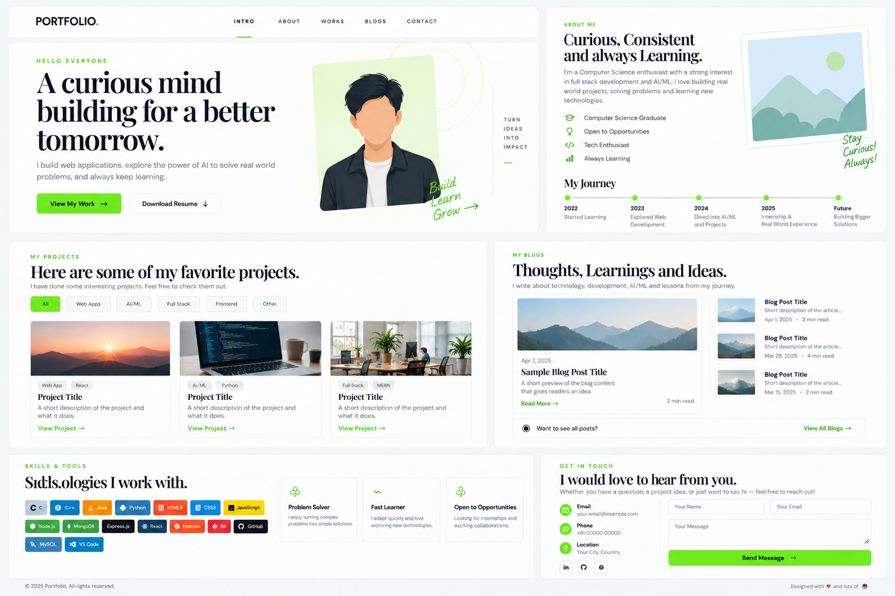

<div align="center">

# my-portfolio

### A clean, responsive developer portfolio built with HTML, CSS & JavaScript.

[](https://manoj-kumar-lodha.netlify.app/)
[](https://github.com/kumarmanoj231/my-portfolio)

</div>

---
## Preview

<p align="center">
  <a href="https://manoj-kumar-lodha.netlify.app/">
    
  </a>
</p>

<p align="center">
  <sub>Portfolio layout overview — introduction, about, projects, skills, blogs and contact.</sub>
</p>

---

## About

A lightweight, single-page developer portfolio designed to present projects, technical skills, learning milestones and contact information in a clean editorial-style interface.

The design focuses on minimal visual hierarchy, strong typography, responsive layouts, subtle borders, bright green accents and lightweight JavaScript interactions.

## Features

- **Responsive design** — desktop, tablet and mobile layouts.
- **Single-page navigation** — smooth navigation with active-section highlighting.
- **Mobile menu** — responsive navigation with keyboard and outside-click handling.
- **Project filtering** — filter projects by category.
- **Skills showcase** — technology badges powered by Devicon.
- **Blog section** — space for technical writing and learning notes.
- **Contact form** — client-side Web3Forms integration.
- **Lazy-loaded images** — improved image loading performance.
- **Image fallback handling** — graceful handling of failed images.
- **Accessible structure** — semantic HTML, labels and ARIA attributes where appropriate.

## Sections

| Section | Purpose |
| --- | --- |
| **Hero** | Introduction, summary and primary actions |
| **About** | Background, strengths and learning journey |
| **Projects** | Selected projects with categories and technology tags |
| **Skills & Tools** | Technologies and development tools |
| **Blogs** | Technical thoughts, learning and ideas |
| **Contact** | Contact details and message form |

## Tech Stack

<p>
  
  
  
  
  
</p>

- **HTML5** — semantic page structure
- **CSS3** — responsive layout, animations and styling
- **Vanilla JavaScript** — navigation, filtering and interactions
- **Google Fonts** — typography
- **Devicon** — technology icons
- **Web3Forms** — contact form submission
- **Netlify** — deployment

## Project Structure

```text
my-portfolio/
├── assets/
│   ├── portfolio-preview.jpg
│   ├── ...                    # Images and downloadable assets
│   └── RESUME.pdf
├── index.html                 # Portfolio markup
├── style.css                  # Responsive styling
├── script.js                  # Interactive behaviour
└── README.md                  # Documentation
```


## Getting Started

### Prerequisites

No framework, package manager or build tool is required.

You only need:

- A modern browser
- Git
- A local development server (recommended)

### Clone

```bash
git clone https://github.com/kumarmanoj231/my-portfolio.git
cd my-portfolio
```

### Run locally

Using **VS Code**, open the project with the **Live Server** extension.


## Customization

Most content can be edited directly in `index.html`.

### Personal details

Update the hero, about section, journey, contact information and social links.

### Projects

Each project card contains a category, technology tags, preview image, description and project URL.

To add a project, duplicate an existing `.project-card` and update its content and `data-category`.

### Skills

Technology badges are maintained in the skills section using Devicon classes.

### Styling

Global typography, colors, spacing, cards, buttons, navigation and responsive breakpoints are maintained in `style.css`.

## JavaScript

`script.js` handles:

```text
Mobile Navigation
        ↓
Active Section Detection
        ↓
Project Filtering
        ↓
Contact Form Submission
        ↓
Image Fallback Handling
```

The portfolio uses lightweight browser APIs such as `IntersectionObserver` instead of a frontend framework.

## Contact Form

The contact form uses **Web3Forms** through a client-side `fetch()` request.

It includes native validation, honeypot protection, loading feedback, success/error messages and form reset behaviour.

If you fork this project, configure your own Web3Forms access key.

- [Web3Forms](https://web3forms.com/)

## Deployment

This is a static website and can be deployed to Netlify, GitHub Pages, Vercel or another static hosting provider.

### Netlify

1. Fork or clone the repository.
2. Import it into Netlify.
3. Use the repository root as the publish directory.
4. No build command is required.
5. Deploy.


## Useful Links

- [HTML MDN](https://developer.mozilla.org/en-US/docs/Web/HTML)
- [CSS MDN](https://developer.mozilla.org/en-US/docs/Web/CSS)
- [JavaScript MDN](https://developer.mozilla.org/en-US/docs/Web/JavaScript)
- [Devicon](https://devicon.dev/)
- [Google Fonts](https://fonts.google.com/)
- [Web3Forms](https://web3forms.com/)
- [Netlify](https://www.netlify.com/)


## Contributing

Contributions are welcome for accessibility, responsiveness, performance, UI quality and maintainability improvements.

```bash
git checkout -b feature/your-change

# make your changes

git add .
git commit -m "feat: describe your change"
git push origin feature/your-change
```

Then open a pull request describing what changed and why.